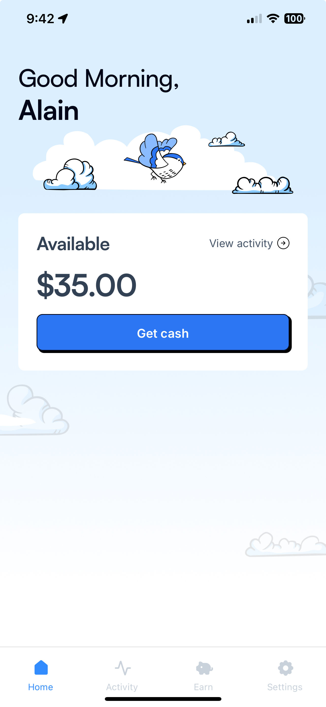

# Bree Sample Updates 
This is a sample app update to show a potential UI/UX update that creates a new bottom bar nav and a new learn screen, that becomes the focus of the app. Since Bree's desire is to help people improve their financial situation, then it would be really beneficial to help improve their financial literacy so they would better learn how to manage their money, and be less reliant on cash advances, and that Bree is still there in case of an emergency. If financial educational content becomes a pillar and is created in a really engaging and easy to way learn, then it may desmistify certain finance concepts that keep people scared and trapped. 

## App Screenshots

### Before:
<div align="center">
  <table>
    <tr>
      <td align="center" width="400px">
        
        <br />
        <em>Home Screen</em>
      </td>
    </tr>
  </table>
</div>

### After:
<div align="center">
  <table>
    <tr>
       <td align="center" width="400px">
        
        <br />
        <em>Learning Paths</em>
      </td>
      <td align="center" width="400px">
        
        <br />
        <em>Home Screen</em>
      </td>
     
    </tr>
  </table>
</div>

## Testing the App on Your Device

To test this

1. Get Expo Go app on your phone
2. Clone here 
   ```
   git clone https://github.com/a-bonus/bree-app.git
   ```

3. Navigate to main folder 
   ```
   cd bree-app
   ```

4. npm install

5. npx expo start 

